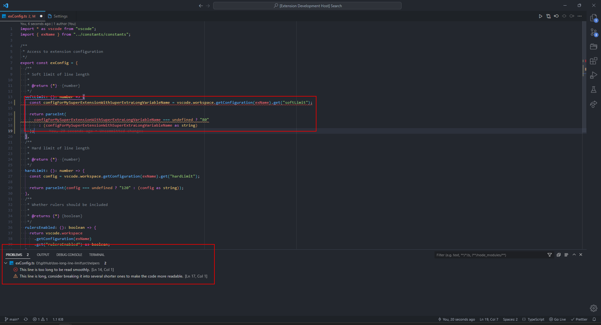

# Too Long - line limit

Create clean and readable code in Visual Studio Code.

Reasons why a line length limit is needed:

- clean, readable code,
- forces you to think about good variable names,
- you can open multiple editors at once and still see the full code,
- comparing versions of files side by side is easier
- some people prefer to use monitors in portrait mode
- less eye movement, harder to get lost in code

## Features

The extension encourages you to write short lines of code, notifying you when you exceed the limit.

Two limits are built in:

- `soft limit` (default 80 characters) - exceeding it results in a warning,
- `hard limit` (default 120 characters) - exceeding it results in an error.

Below you can see the extension in action.

## Extension Settings

* `too-long-line.limit.rulersEnabled`: Used to determine whether rulers should be visible.
* `too-long-line-limit.softLimit`: Limit of the number of characters, after which a warning will be displayed.
* `too-long-line-limit.hardLimit`: Limit of the number of characters, after which a error will be displayed.

## Release Notes

Release notes can be found [here](https://github.com/MASSHUU12/too-long-line-limit/blob/main/CHANGELOG.md).

## License

Licensed under the [MIT](https://github.com/MASSHUU12/too-long-line-limit/blob/main/LICENSE) license.
